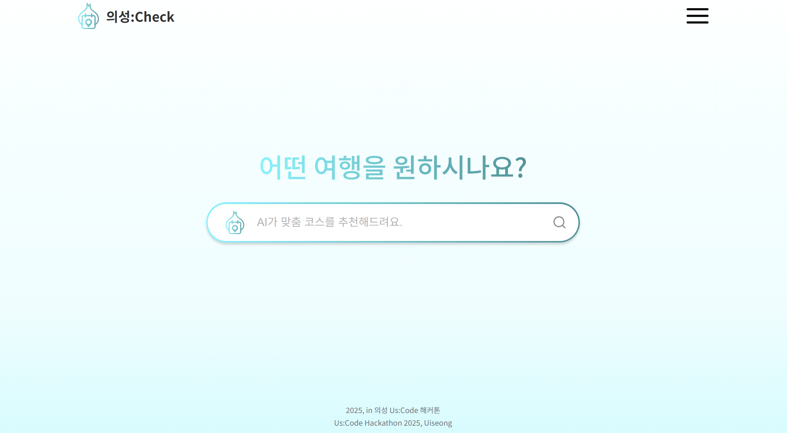

# 의성:Check - 의성군 AI 여행 추천 플랫폼

의성군의 관광지, 맛집, 숙박 시설을 AI 기반으로 추천하고 여행 패키지를 제공하는 웹 애플리케이션입니다.

## 🌟 주요 기능

### 🤖 AI 여행 추천

- 사용자의 선호도에 따른 맞춤형 여행 코스 생성
- 자연어 입력을 통한 직관적인 여행 계획 수립
- 실시간 AI 분석을 통한 최적화된 루트 제안

### 🎰 파친코 스타일 여행지 선택

- 재미있는 파친코 게임 방식으로 여행지 탐색
- 관광지, 음식점, 숙박시설 카테고리별 선택
- 스핀을 통한 랜덤 추천으로 새로운 발견의 즐거움

### 🗺️ 지도 통합 서비스

- 네이버 지도 API를 활용한 위치 기반 서비스
- 선택한 여행지들의 최적 경로 표시
- 실시간 위치 정보와 상세 지도 보기

### 💳 통합 결제 시스템

- 카카오페이, 토스페이 연동
- 여행 패키지 일괄 결제
- QR 코드 생성으로 현장 결제 편의성 제공

### 📱 QR 코드 예약 관리

- 결제 완료 후 QR 코드 자동 생성
- 현장에서 QR 스캔으로 간편 이용
- 예약 내역 및 여행 일정 관리

## 🎬 Demo Video

<a href="https://www.youtube.com/watch?v=EjaPMB0wIrY" target="_blank">
  
</a>

[Watch the demo video on YouTube](https://www.youtube.com/watch?v=EjaPMB0wIrY)

## 🛠️ 기술 스택

### Frontend

- **React 18.3.1** - 메인 프레임워크
- **React Router Dom 6.30.1** - 라우팅
- **Styled Components 6.1.19** - 스타일링
- **Framer Motion 12.19.2** - 애니메이션
- **React Icons 5.5.0** - 아이콘

### 지도 & 외부 API

- **Naver Maps API** - 지도 서비스
- **React DatePicker 8.4.0** - 날짜 선택

### 상태 관리 & 네트워킹

- **Axios 1.10.0** - HTTP 클라이언트
- **LocalStorage** - 클라이언트 사이드 데이터 저장

## 📂 프로젝트 구조

```
src/
├── components/              # 재사용 가능한 컴포넌트
│   ├── MainpageModal.js    # 메인페이지 모달
│   └── MainpageModalStyle.js
├── pages/                   # 페이지 컴포넌트
│   ├── Mainpage.js         # 메인 페이지 (검색)
│   ├── LoginPage.js        # 구글 소셜 로그인
│   ├── LoadingPage.js      # AI 분석 로딩
│   ├── PachinkoPage.js     # 파친코 스타일 선택
│   ├── RoutePage.js        # 경로 및 상세 정보
│   ├── PaymentPage.js      # 결제 처리
│   ├── MyReservations.js   # 예약 관리
│   ├── UserInfoPage.js     # 사용자 정보
│   ├── AddStorePage.js     # 사업자 등록
│   ├── NaverMapComponent.js # 지도 컴포넌트
│   └── qrtest.js           # QR 코드 생성/표시
├── styles/                  # 스타일 컴포넌트
│   ├── GlobalStyle.js      # 전역 스타일
│   ├── MainpageStyle.js    # 각 페이지별 스타일
│   └── ...
├── App.js                   # 메인 앱 컴포넌트
└── index.js                # 진입점
```

## 🚀 시작하기

### 📋 사전 요구사항

- Node.js 16.0.0 이상
- npm 또는 yarn 패키지 매니저
- 네이버 지도 API 키
- 백엔드 API 서버 (환경변수 설정 필요)

### ⚙️ 환경 설정

1. **저장소 클론**

   ```bash
   git clone [repository-url]
   cd client
   ```

2. **의존성 설치**

   ```bash
   npm install
   # 또는
   yarn install
   ```

3. **환경변수 설정**

   프로젝트 루트에 `.env` 파일을 생성하고 다음 내용을 추가하세요:

   ```env
   REACT_APP_NAVER_CLIENT_ID=your_naver_map_client_id
   REACT_APP_API_URL=your_backend_api_url
   PUBLIC_URL=/
   ```

4. **API 키 발급**
   - [네이버 클라우드 플랫폼](https://www.ncloud.com/)에서 Maps API 키 발급

### 🏃‍♂️ 실행 방법

**개발 서버 실행**

```bash
npm start
```

브라우저에서 `http://localhost:3000`으로 접속

**프로덕션 빌드**

```bash
npm run build
```

**테스트 실행**

```bash
npm test
```

### 🔧 주요 설정 파일

- `package.json` - 프로젝트 의존성 및 스크립트
- `public/index.html` - HTML 템플릿 (Kakao Maps SDK 포함)
- `src/App.js` - 라우팅 설정
- `src/styles/GlobalStyle.js` - 전역 스타일 설정

## 📱 사용 방법

### 1. 여행 계획 시작

- 메인페이지에서 원하는 여행 스타일을 자연어로 입력
- "가족과 함께하는 힐링 여행", "맛집 투어" 등

### 2. AI 추천 확인

- 로딩 페이지에서 AI가 분석한 추천 결과 대기
- 파친코 페이지에서 재미있게 여행지 선택

### 3. 상세 계획 수립

- 경로 페이지에서 선택한 장소들의 위치 확인
- 여행 날짜 설정 및 숙박/식당 수량 조정

### 4. 결제 및 예약

- 카카오페이/토스페이로 간편 결제
- QR 코드 발급으로 현장 이용

## 🎯 주요 기능 흐름

```
메인페이지 → AI 분석 → 파친코 선택 → 경로 확인 → 결제 → QR 발급
    ↓           ↓          ↓          ↓        ↓       ↓
  검색 입력   로딩 화면   게임 방식   지도 보기   간편결제  현장 이용
```

## 🏪 사업자 기능

### 가맹점 등록

- `/addstore` 경로에서 사업자 등록 가능
- 사업자번호, 위치정보, 가격 정보 등록
- 의성군 관광 네트워크 참여

## 🛡️ 보안 및 개인정보

- 구글 소셜 로그인을 통한 안전한 인증
- 결제 정보는 외부 결제 서비스(카카오페이/토스페이)를 통해 처리
- 개인정보는 여행 서비스 제공 목적으로만 사용
